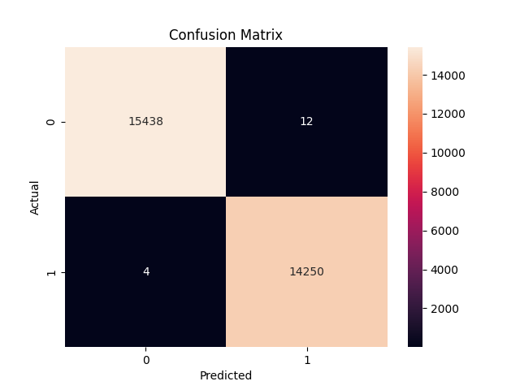
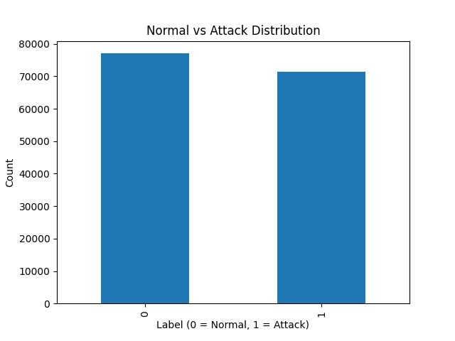
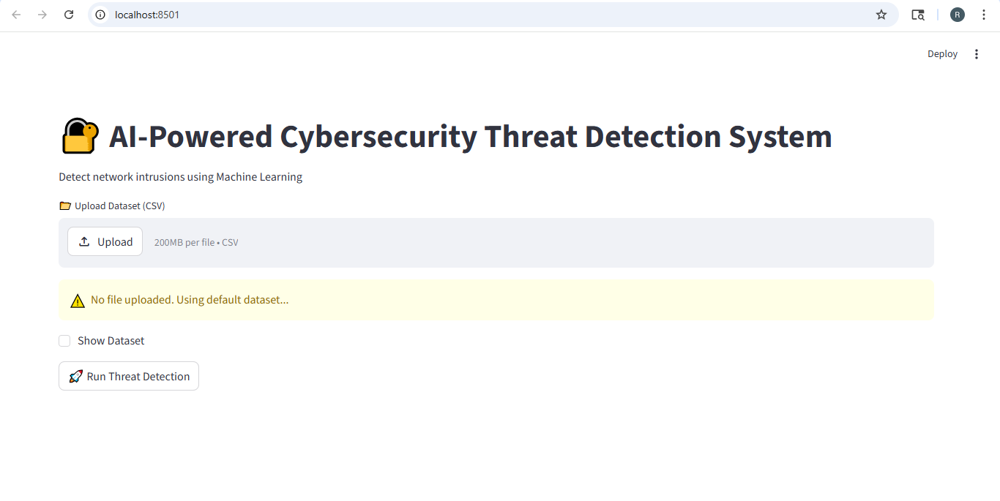
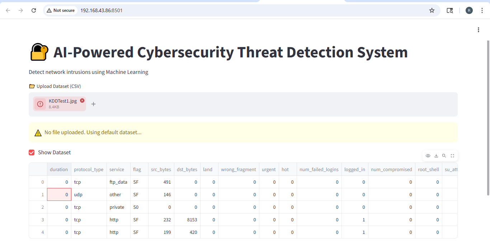

# 🔐 AI-Powered Cybersecurity Threat Detection System

## 📌 Overview
This project is an AI-based cybersecurity system that detects malicious network activity using machine learning. It analyzes network traffic data and classifies it as **normal** or **attack**, simulating a real-world intrusion detection system (IDS).

---

## 🚨 Problem Statement
Traditional security systems struggle to detect evolving cyber threats. This project uses machine learning to automatically identify anomalies and potential attacks in network traffic.

---

## 💡 Solution
- Built a classification model using **Random Forest**
- Used **NSL-KDD dataset** to simulate real-world network traffic
- Implemented:
  - Data preprocessing
  - Feature engineering
  - Model training & evaluation
  - Threat detection logic
  - Visualization of results

---

## 🧠 Tech Stack
- Python
- Pandas, NumPy
- Scikit-learn
- Matplotlib, Seaborn

---

## ⚙️ Project Workflow

1. Data Collection (NSL-KDD dataset)
2. Data Preprocessing
3. Feature Encoding
4. Model Training (Random Forest)
5. Model Evaluation
6. Threat Detection
7. Visualization

---

## 📊 Results

- **Accuracy:** ~99%
- Model successfully detects:
  - Normal traffic
  - Malicious activity

---

## 📈 Visualizations

### 🔹 Confusion Matrix


### 🔹 Label Distribution


---
## 🖥️ Streamlit UI (Frontend)

This project includes an interactive web interface built using Streamlit for real-time threat detection.

### 🔹 Application Start


### 🔹 Threat Detection Output


---

## 🚀 How to Run

```bash
# Clone repo
git clone <your-repo-link>

# Go to project folder
cd AI-Cybersecurity-Threat-Detection-System

# Activate virtual environment
venv\Scripts\activate

# Install dependencies
pip install -r requirements.txt

# Run project
python main.py